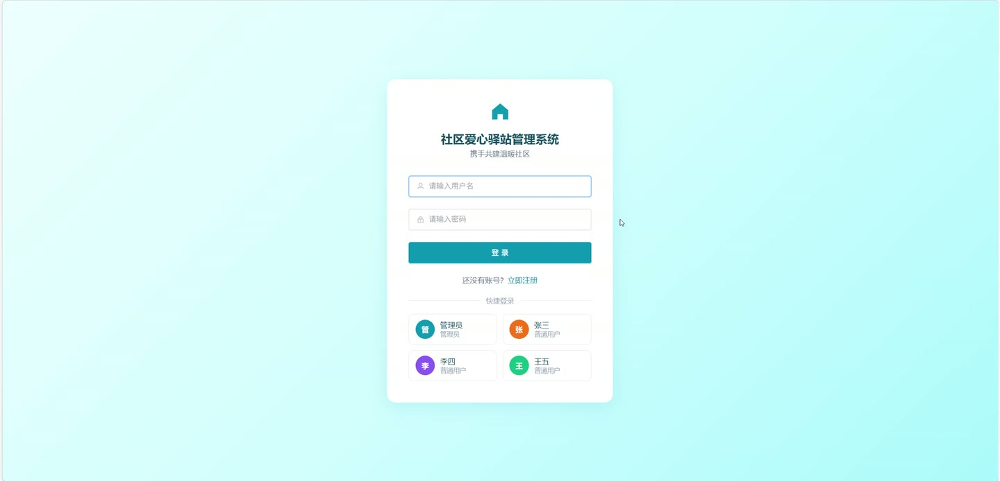
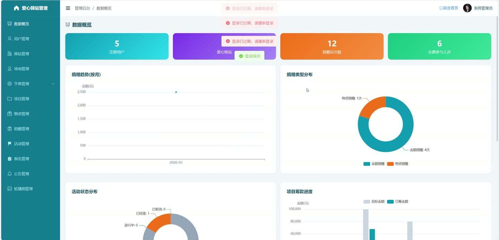
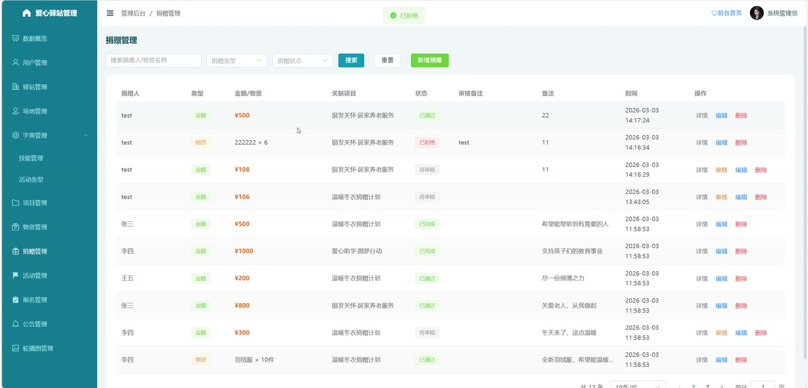

# (附文档)Springboot3+Vue3+MySQL 社区爱心驿站服务系统

**技术栈**：Springboot3、Vue3、MySQL

### 系统简介

社区爱心驿站服务系统是一套基于 SpringBoot3 + Vue3 前后端分离架构的社区公益管理平台，支持普通用户、管理员两种角色。系统涵盖志愿活动管理、物资管理、捐赠管理、公益项目管理、驿站管理、场地管理、技能管理、公告管理、轮播图管理、用户管理、数据统计看板等核心业务模块，提供从活动发布、报名审核、签到记录到物资出入库、捐赠审核、项目筹款的全流程数字化管理。
 
### 核心功能
 
### 普通用户端

 
- 用户注册与登录：通过用户名密码注册新账号，登录后自动获取 JWT Token 鉴权。 
- 个人中心：查看个人信息、修改昵称/头像/手机号/邮箱等资料，修改登录密码。 
- 个人统计：查看本人的捐赠次数、报名活动数、签到次数等汇总数据。 
- 浏览志愿活动：按活动类型、状态、驿站等条件筛选活动列表，查看活动详情（含封面、时间、地点、所需技能、已报名人数）。 
- 报名活动：选择活动并填写备注，提交报名申请等待管理员审核，报名后可在"我的报名"中查看审核状态。 
- 活动签到：到达活动现场后通过活动 ID 进行签到，签到后记录签到时间。 
- 我的技能管理：查看已选技能列表，从系统技能库中批量选择并保存自己的技能标签。 
- 提交捐赠：选择捐赠类型（金额/物资）、填写物品名称/数量/金额/所属项目，提交后进入待审核状态。 
- 我的捐赠记录：分页查看本人提交的所有捐赠记录及审核状态。 
- 浏览公益项目：按分类、状态筛选项目列表，查看项目详情（目标金额、已筹金额、进度、发布方）。 
- 查看系统公告：浏览公告列表，按类型筛选，点击查看公告全文。 
- 查看爱心驿站：浏览驿站列表，查看驿站名称、地址、工作时间、联系电话等详情。
 
### 管理员端

 
- 数据概览看板：查看用户总数、驿站数、项目数、捐赠次数、活动数、志愿者人次、物资种类数、捐赠总金额等核心指标。 
- 捐赠统计图表：按月统计金额捐赠趋势，按类型（金额/物资）统计捐赠占比。 
- 活动统计图表：按状态（报名中/进行中/已结束/已取消）统计活动数量，展示报名人数 Top5 活动。 
- 物资统计图表：按分类统计物资总量与已用量，按状态（已耗尽/充足/紧缺/已过期）统计物资数量。 
- 项目筹款进度图表：展示所有项目的目标金额与当前已筹金额对比。 
- 用户管理：分页查询普通用户（支持关键词/状态筛选），重置用户密码为 123456，启用/禁用用户账号，删除用户。 
- 活动类型管理：新增、修改、删除活动类型，设置类型名称、排序号、启用状态。 
- 志愿活动管理：发布新活动（填写标题、封面、内容、类型、场地、地点、起止时间、报名截止时间、最大参与人数、所需技能），修改活动信息，删除活动。 
- 活动报名审核：查看活动的报名列表，审核通过或拒绝报名申请，填写审核备注。 
- 活动签到管理：管理员可按报名记录 ID 手动签到，标记志愿者已到场。 
- 物资管理：新增物资（填写名称、分类、总量、已用量、所属驿站/项目），修改物资信息，删除物资。 
- 物资入库：选择物资并填写入库数量、关联捐赠单号、备注，系统自动更新库存并记录流转。 
- 物资出库：选择物资并填写出库数量、去向描述、备注，系统自动扣减库存并记录流转。 
- 物资流转记录：按物资、记录类型（入库/出库）筛选查看所有出入库明细，显示操作人、数量、时间。 
- 捐赠审核：查看捐赠记录列表（按类型/状态筛选），审核通过或拒绝捐赠，拒绝时必须填写理由；审核通过后自动更新对应项目的已筹金额。 
- 公益项目管理：发布新项目（填写标题、封面、目标金额、分类、所属驿站），修改项目信息，删除项目。 
- 爱心驿站管理：新增驿站（填写名称、地址、工作时间、联系电话、经纬度），修改驿站信息，删除驿站。 
- 场地管理：新增场地（填写名称、容量、所属驿站、状态），修改场地信息，删除场地，查看可用场地列表。 
- 技能管理：新增、修改、删除技能标签（技能名称、启用状态）。 
- 系统公告管理：发布公告（选择公告类型、填写标题、内容），修改公告，删除公告。 
- 轮播图管理：新增轮播图（上传图片、设置链接、排序号、启用状态），修改轮播图，删除轮播图。 
- 文件上传：上传图片/文件到服务器，返回可访问的 URL 地址。
 
### 技术栈

 后端框架Spring Boot 3.x ORMMyBatis-Plus 权限校验JWT Token 鉴权（拦截器） 前端框架Vue 3 状态管理Pinia 构建工具Vite 数据库MySQL HTTP 客户端Axios UI 组件库Element Plus 数据可视化ECharts 工具库Hutool
 
### 交付内容

 
- 后端完整源码 
- 前端完整源码 
- 数据库初始化脚本 
- 万字文档

## 界面展示

---

## 获取完整源码 + 万字文档

本仓库为项目介绍页。**完整前后端源码、数据库初始化脚本、万字项目文档**，请加微信 `kangkangcode`，或访问 [codekk.top](http://codekk.top) 获取。

可作课程设计 / 毕业设计参考，支持远程部署调试。